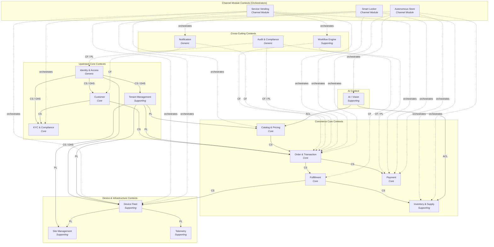

# D1 - Domain Context Map

## Overview

This document defines the formal DDD Context Map for the IVM Platform, identifying all bounded contexts, their relationships, integration patterns, and team ownership boundaries.

---

## 1. Bounded Contexts Summary

| # | Bounded Context | Core Domain / Supporting / Generic | Owner Team |
|---|---|---|---|
| 1 | Identity & Access | Generic | Platform Team |
| 2 | Customer | Core | Platform Team |
| 3 | KYC & Compliance | Core | Platform Team |
| 4 | Tenant Management | Supporting | Platform Team |
| 5 | Catalog & Pricing | Core | Commerce Team |
| 6 | Order & Transaction | Core | Commerce Team |
| 7 | Fulfillment | Core | Commerce Team |
| 8 | Payment | Core | Payments Team |
| 9 | Device Fleet | Supporting | IoT Team |
| 10 | Site Management | Supporting | IoT Team |
| 11 | Telemetry | Supporting | IoT Team |
| 12 | Workflow Engine | Supporting | Platform Team |
| 13 | Notification | Generic | Platform Team |
| 14 | Audit & Compliance | Generic | Platform Team |
| 15 | Inventory & Supply | Supporting | Commerce Team |
| 16 | Service Vending (Channel) | Core | Channels Team |
| 17 | Smart Locker (Channel) | Core | Channels Team |
| 18 | Autonomous Store (Channel) | Core | Channels Team |
| 19 | AI / Vision | Supporting | AI Team |

---

## 2. Context Map Diagram (Mermaid)

### Legend

| Abbreviation | DDD Integration Pattern | Description |
|---|---|---|
| **CS** | Customer-Supplier | Upstream provides API; downstream consumes. Upstream accommodates downstream needs. |
| **CF** | Conformist | Downstream conforms to upstream's model without negotiation. |
| **ACL** | Anti-Corruption Layer | Downstream translates upstream concepts to protect its own domain model. |
| **OHS** | Open Host Service | Upstream exposes a well-defined, published protocol (REST/gRPC + events). |
| **PL** | Published Language | A shared, versioned language (schemas, contracts) agreed upon between contexts. |
| **SK** | Shared Kernel | A small shared model co-owned by two contexts (used sparingly). |

---

## 3. Relationship Details

### 3.1 Identity & Access --> Customer (CS / OHS)
- Identity provides user authentication; Customer holds customer profile data.
- Identity publishes `ivm.user.created` → Customer creates a customer record.
- Customer calls Identity via gRPC `ValidateToken` and `GetUserPermissions`.

### 3.2 Identity & Access --> KYC & Compliance (CS / OHS)
- KYC depends on Identity to validate who is requesting verification.
- Identity provides user context; KYC owns the verification state machine.

### 3.3 Identity & Access --> Device Fleet (CS / OHS)
- Device Fleet depends on Identity for device enrollment and mTLS certificate management.
- Identity publishes `DeviceIdentity` as an Open Host Service.

### 3.4 Customer --> KYC & Compliance (CS)
- Customer supplies customer profile data; KYC consumes it for identity verification.
- KYC publishes `ivm.customer.kyc_tier_changed` back to Customer (event-driven update).

### 3.5 Customer --> Order & Transaction (CS)
- Order references `customerId` but does not own customer data.
- Order consumes Customer API to resolve customer details for display.

### 3.6 Tenant Management --> All Contexts (PL)
- Tenant Management defines the `TenantContext` Published Language.
- All contexts receive tenant context via JWT claims and event envelopes.
- Tenant configuration (branding, features, settlement) is the canonical source.

### 3.7 Catalog & Pricing --> Order & Transaction (CS)
- Catalog is upstream; Order references `catalogItemId` but owns its own price snapshot.
- Order captures price at order-creation time (immutable line item pricing).

### 3.8 Order & Transaction --> Payment (CS)
- Order initiates payment; Payment is downstream for authorization & capture.
- Payment publishes `ivm.payment.authorized` → Order transitions state.

### 3.9 Order & Transaction --> Fulfillment (CS)
- Order creates `FulfillmentTask` records; Fulfillment manages execution.
- Fulfillment publishes `ivm.order.fulfillment_completed` → Order transitions to `COMPLETED`.

### 3.10 Fulfillment --> Inventory & Supply (CS)
- Fulfillment checks stock availability; Inventory manages stock levels.
- Inventory publishes `ivm.inventory.low_stock` for replenishment alerts.

### 3.11 Fulfillment --> Device Fleet (CS)
- Fulfillment sends device commands (dispense, unlock, print) via Device Fleet API.
- Device Fleet publishes command acknowledgement events.

### 3.12 Device Fleet --> Site Management (PL)
- Devices belong to Sites. Site defines the physical deployment topology.
- Shared `siteId` as a Published Language concept.

### 3.13 Device Fleet --> Telemetry (PL)
- Devices emit telemetry via MQTT. Telemetry Context ingests and stores time-series data.
- Published Language: MQTT topic structure and telemetry payload schema.

### 3.14 AI / Vision --> Catalog (ACL)
- AI/Vision needs product information for item detection.
- ACL translates Catalog items into inference model labels/SKUs.
- Vision never calls Catalog directly; it uses a local product reference cache.

### 3.15 AI / Vision --> Inventory (ACL)
- AI/Vision detects shelf state changes.
- ACL translates vision events into inventory stock-level updates.

### 3.16 Channel Modules (Orchestrators)
- **Service Vending**, **Smart Locker**, and **Autonomous Store** are orchestrator contexts.
- They own no persistent data stores — they compose core service APIs and workflows.
- They are downstream conformists to all core contexts.
- They define channel-specific workflow definitions consumed by the Workflow Engine.

### 3.17 Cross-Cutting Contexts
- **Workflow Engine**: Conformist to Order and Fulfillment (executes their workflow definitions).
- **Notification**: Conformist to any context that publishes `NotificationRequested` events.
- **Audit**: Subscribes to all domain events via Published Language (CloudEvents envelope).

---

## 4. Anti-Corruption Layers

| Boundary | ACL Purpose | Implementation |
|---|---|---|
| AI/Vision ↔ Catalog | Translate product catalog into ML model labels | Product reference sync adapter with local cache |
| AI/Vision ↔ Inventory | Translate vision detections into inventory events | Event translator service at edge |
| Payment ↔ External PSPs | Translate PSP-specific responses to IVM payment model | Gateway adapter framework (Paystack, Flutterwave, etc.) |
| KYC ↔ External Verifiers | Translate NIBSS/NIMC responses to IVM verification model | Verification provider adapters |
| Service Vending ↔ External Providers | Translate telco/insurance/banking APIs | Partner integration adapter registry |

---

## 5. Shared Kernel

The platform uses **no shared database** across bounded contexts. The only Shared Kernel elements are:

| Shared Concept | Owned By | Consumed By | Form |
|---|---|---|---|
| `TenantContext` | Tenant Management | All contexts | JWT claims + event envelope extension |
| `Money` value object | (Convention) | Order, Payment, Catalog, Settlement | Identical value object definition (amount in minor units + ISO 4217 currency) |
| `Address` value object | (Convention) | Customer, Site, Tenant | Identical value object definition |
| Prefixed ULID format | (Convention) | All contexts | ID generation convention (`ord_`, `pay_`, `dev_`, etc.) |
| CloudEvents envelope | (Convention) | All contexts | Event wire format per CloudEvents 1.0 spec |

---

## 6. Context Map — Upstream/Downstream Summary

| Upstream Context | Downstream Context | Pattern | Communication |
|---|---|---|---|
| Identity & Access | Customer | CS / OHS | gRPC + Events |
| Identity & Access | KYC & Compliance | CS / OHS | gRPC |
| Identity & Access | Device Fleet | CS / OHS | gRPC + mTLS |
| Identity & Access | Tenant Management | CS / OHS | gRPC |
| Customer | KYC & Compliance | CS | Events + REST |
| Customer | Order & Transaction | CS | REST |
| Tenant Management | All contexts | PL | JWT + Events |
| Catalog & Pricing | Order & Transaction | CS | REST |
| Catalog & Pricing | AI / Vision | ACL | Cached sync |
| Order & Transaction | Payment | CS | gRPC + Events |
| Order & Transaction | Fulfillment | CS | Events |
| Fulfillment | Device Fleet | CS | gRPC + MQTT |
| Fulfillment | Inventory & Supply | CS | REST + Events |
| Device Fleet | Site Management | PL | REST |
| Device Fleet | Telemetry | PL | MQTT |
| Inventory & Supply | AI / Vision | ACL | Events |
| All Contexts | Audit & Compliance | PL | Events (subscribe-all) |
| All Contexts | Notification | CF | Events |
| Core Contexts | Channel Modules | CF | REST + Events |
| Workflow Engine | Order + Fulfillment | CF | Events + gRPC |
