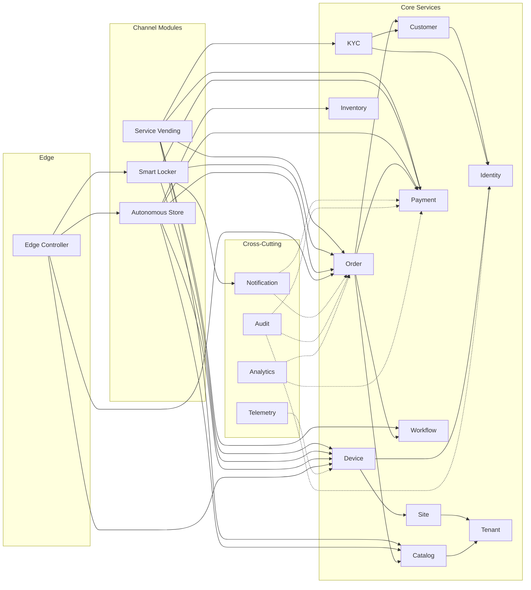

# D2 - Service Responsibility Matrix

## Overview

This document provides a consolidated view of every service in the IVM Platform, its responsibilities, owned entities, dependencies, exposed interfaces, and consumed events.

---

## 1. Core Platform Services

### 1.1 Identity & Access Management Service

| Attribute | Value |
|---|---|
| **Service Name** | `ivm-identity-service` |
| **Bounded Context** | Identity & Access |
| **Database** | `ivm_identity` |
| **Owned Entities** | `User`, `Role`, `Permission`, `DeviceIdentity`, `Session` |
| **Responsibilities** | User authentication (password, OTP, biometric); Device authentication (mTLS); RBAC with tenant scoping; OAuth2/OIDC provider; Session lifecycle management; MFA enrollment and verification |
| **Exposes (REST)** | `POST /auth/register`, `POST /auth/login`, `POST /auth/token/refresh`, `POST /auth/device/enroll`, `POST /auth/device/authenticate` (12 endpoints) |
| **Exposes (gRPC)** | `IdentityService.ValidateToken`, `IdentityService.GetUserPermissions`, `IdentityService.AuthenticateDevice` |
| **Produces Events** | `ivm.user.created`, `ivm.user.authenticated`, `ivm.user.authentication_failed`, `ivm.user.suspended`, `ivm.user.reactivated`, `ivm.device.enrolled`, `ivm.device.authenticated`, `ivm.device.certificate_rotated` |
| **Consumes Events** | None (upstream) |
| **Dependencies** | None (root upstream service) |

---

### 1.2 Customer Service

| Attribute | Value |
|---|---|
| **Service Name** | `ivm-customer-service` |
| **Bounded Context** | Customer |
| **Database** | `ivm_customer` |
| **Owned Entities** | `Customer`, `IdentityEvidence`, `Address`, `CustomerPreferences` |
| **Responsibilities** | Customer profile management; Customer-level KYC tier tracking; Identity evidence storage; Customer preferences; Customer order/payment history aggregation |
| **Exposes (REST)** | `GET /customers/:id`, `PATCH /customers/:id`, `GET /customers/:id/kyc`, `GET /customers/:id/orders`, `GET /customers/:id/payments` (10 endpoints) |
| **Produces Events** | `ivm.customer.created`, `ivm.customer.updated`, `ivm.customer.kyc_tier_changed`, `ivm.customer.identity_evidence_added`, `ivm.customer.identity_verified`, `ivm.customer.identity_verification_failed` |
| **Consumes Events** | `ivm.user.created` (creates customer record) |
| **Dependencies** | Identity Service (authentication context), KYC Service (verification results) |

---

### 1.3 KYC & Verification Service

| Attribute | Value |
|---|---|
| **Service Name** | `ivm-kyc-service` |
| **Bounded Context** | KYC & Compliance |
| **Database** | `ivm_customer` (shared schema for identity_evidence table, owned by Customer context with KYC write access) |
| **Owned Entities** | Verification workflow state, verification result caching |
| **Responsibilities** | BVN verification (NIBSS adapter); NIN verification (NIMC adapter); Document OCR verification; Biometric capture/matching; KYC tier classification (CBN Tier 1/2/3); Verification result caching with TTL |
| **Exposes (REST)** | `POST /customers/:id/kyc/verify-bvn`, `POST /customers/:id/kyc/verify-nin`, `POST /customers/:id/kyc/verify-doc`, `POST /customers/:id/kyc/biometric`, `GET /customers/:id/kyc/tier` |
| **Exposes (gRPC)** | `KycService.VerifyBVN`, `KycService.VerifyNIN`, `KycService.GetKycStatus`, `KycService.CheckKycTier` |
| **Produces Events** | `ivm.customer.identity_verified`, `ivm.customer.identity_verification_failed`, `ivm.customer.kyc_tier_changed` |
| **Consumes Events** | `ivm.customer.created` (auto-initiate basic verification if data available) |
| **Dependencies** | Identity Service, Customer Service, External: NIBSS, NIMC, ICAD |

---

### 1.4 Tenant Management Service

| Attribute | Value |
|---|---|
| **Service Name** | `ivm-tenant-service` |
| **Bounded Context** | Tenant Management |
| **Database** | `ivm_tenant` |
| **Owned Entities** | `Tenant`, `BrandingConfig`, `SettlementConfig`, `FeatureFlags` |
| **Responsibilities** | Tenant onboarding and lifecycle; Tenant hierarchy (parent org → sub-merchants → sites); White-label branding configuration; Feature flag management; Settlement account configuration; Billing and entitlements |
| **Exposes (REST)** | `POST /tenants`, `GET /tenants/:id`, `PATCH /tenants/:id`, `GET /tenants/:id/sites`, `GET /tenants/:id/merchants`, `PATCH /tenants/:id/branding`, `PATCH /tenants/:id/features`, `GET /tenants/:id/billing`, `GET /tenants/:id/analytics` (9 endpoints) |
| **Produces Events** | `ivm.tenant.created`, `ivm.tenant.updated`, `ivm.tenant.suspended`, `ivm.tenant.feature_changed` |
| **Consumes Events** | None |
| **Dependencies** | Identity Service (operator authentication) |

---

### 1.5 Catalog & Pricing Service

| Attribute | Value |
|---|---|
| **Service Name** | `ivm-catalog-service` |
| **Bounded Context** | Catalog & Pricing |
| **Database** | `ivm_catalog` |
| **Owned Entities** | `CatalogItem`, `Category`, `Promotion`, `PricingRule` |
| **Responsibilities** | Unified product/service catalog (physical goods, SIMs, insurance, banking services, tickets, documents); Category taxonomy; Tenant-scoped catalog views; Dynamic pricing engine (rules, time, location); Promotions and discounts; Channel/site availability filtering |
| **Exposes (REST)** | `GET /catalog/items`, `GET /catalog/items/:id`, `POST /catalog/items`, `PATCH /catalog/items/:id`, `GET /catalog/categories`, `POST /catalog/categories`, `GET /catalog/items/:id/price`, `POST /catalog/price/calculate`, `GET /catalog/promotions`, `POST /catalog/promotions` (10 endpoints) |
| **Produces Events** | `ivm.catalog.item_created`, `ivm.catalog.item_updated`, `ivm.catalog.price_changed`, `ivm.catalog.promotion_activated` |
| **Consumes Events** | `ivm.tenant.feature_changed` (catalog feature availability) |
| **Dependencies** | Tenant Service (tenant-scoped views) |

---

### 1.6 Order & Transaction Service

| Attribute | Value |
|---|---|
| **Service Name** | `ivm-order-service` |
| **Bounded Context** | Order & Transaction |
| **Database** | `ivm_order` |
| **Owned Entities** | `Order`, `OrderLineItem`, `FulfillmentTask`, `Money` |
| **Responsibilities** | Order lifecycle management (DRAFT → PENDING_PAYMENT → PAYMENT_AUTHORIZED → FULFILLING → COMPLETED); Immutable transaction ledger; Idempotent order creation; Cross-channel order visibility; Dispute management |
| **Exposes (REST)** | `POST /orders`, `GET /orders/:id`, `PATCH /orders/:id`, `POST /orders/:id/confirm`, `POST /orders/:id/cancel`, `GET /orders/:id/fulfillment`, `POST /orders/:id/dispute`, `GET /orders` (8 endpoints) |
| **Produces Events** | `ivm.order.created`, `ivm.order.confirmed`, `ivm.order.payment_authorized`, `ivm.order.fulfillment_started`, `ivm.order.fulfillment_completed`, `ivm.order.completed`, `ivm.order.cancelled`, `ivm.order.disputed`, `ivm.order.dispute_resolved` |
| **Consumes Events** | `ivm.payment.authorized`, `ivm.payment.captured`, `ivm.payment.failed`, `ivm.order.fulfillment_completed` |
| **Dependencies** | Catalog Service (price resolution), Payment Service (payment initiation), Customer Service (customer context), Workflow Engine (workflow orchestration) |

---

### 1.7 Payment Orchestration Service

| Attribute | Value |
|---|---|
| **Service Name** | `ivm-payment-service` |
| **Bounded Context** | Payment |
| **Database** | `ivm_payment` |
| **Owned Entities** | `Payment`, `TokenizedCard`, `SettlementRecord`, `Refund` |
| **Responsibilities** | Payment method management (card tokenization, mobile money, bank transfer, wallet, USSD, QR); Payment gateway adapter framework (Paystack, Flutterwave, bank APIs); Pre-auth and capture flow; Refund and void processing; Settlement engine (merchant payouts, commission splits); PCI DSS scope minimization; Reconciliation |
| **Exposes (REST)** | `POST /payments`, `POST /payments/:id/authorize`, `POST /payments/:id/capture`, `POST /payments/:id/void`, `POST /payments/:id/refund`, `GET /payments/:id`, `GET /payments/:id/status`, `POST /payments/methods`, `GET /payments/methods`, `DELETE /payments/methods/:id`, `GET /settlements`, `GET /settlements/:id` (12 endpoints) |
| **Exposes (gRPC)** | `PaymentService.InitiatePayment`, `PaymentService.AuthorizePayment`, `PaymentService.CapturePayment`, `PaymentService.RefundPayment`, `PaymentService.GetPaymentStatus` |
| **Produces Events** | `ivm.payment.initiated`, `ivm.payment.authorized`, `ivm.payment.captured`, `ivm.payment.failed`, `ivm.payment.refunded`, `ivm.payment.settled` |
| **Consumes Events** | `ivm.order.confirmed` (triggers payment initiation) |
| **Dependencies** | External PSPs (Paystack, Flutterwave, bank APIs), Order Service (order context) |

---

### 1.8 Workflow Engine Service

| Attribute | Value |
|---|---|
| **Service Name** | `ivm-workflow-service` |
| **Bounded Context** | Workflow Engine |
| **Database** | `ivm_workflow` |
| **Owned Entities** | `WorkflowDefinition`, `WorkflowStep`, `WorkflowInstance`, `StepExecution` |
| **Responsibilities** | BPMN-inspired workflow definition (JSON/YAML DSL); Step types: user-input, system-action, approval, timer, branch, parallel, compensation; Workflow versioning and migration; Compensation/rollback handlers; Workflow state persistence and resumability; Analytics (completion, drop-off, duration) |
| **Exposes (REST)** | `GET /workflows/definitions`, `POST /workflows/definitions`, `GET /workflows/definitions/:id`, `PATCH /workflows/definitions/:id`, `POST /workflows/instances`, `GET /workflows/instances/:id`, `POST /workflows/instances/:id/advance`, `POST /workflows/instances/:id/cancel`, `GET /workflows/instances/:id/history` (9 endpoints) |
| **Exposes (gRPC)** | `WorkflowService.StartWorkflow`, `WorkflowService.AdvanceStep`, `WorkflowService.GetState`, `WorkflowService.CancelWorkflow` |
| **Produces Events** | `ivm.workflow.started`, `ivm.workflow.step_completed`, `ivm.workflow.step_failed`, `ivm.workflow.completed`, `ivm.workflow.failed`, `ivm.workflow.compensating` |
| **Consumes Events** | `ivm.order.created` (auto-start workflow), `ivm.payment.authorized` (advance step), `ivm.device.command_executed` (advance step) |
| **Dependencies** | Order Service, Payment Service, Device Service (for step execution) |

---

### 1.9 Device Registry & Fleet Management Service

| Attribute | Value |
|---|---|
| **Service Name** | `ivm-device-service` |
| **Bounded Context** | Device Fleet |
| **Database** | `ivm_device` |
| **Owned Entities** | `Device`, `DeviceCapability`, `DeviceConfig`, `DeviceHealthSnapshot` |
| **Responsibilities** | Device enrollment and provisioning; Device identity (certificates, hardware fingerprint); Configuration management (remote push); Fleet grouping (by site, tenant, type, firmware); OTA update orchestration (TUF-signed); Device lifecycle management; Remote command execution; Health monitoring |
| **Exposes (REST)** | `POST /devices`, `GET /devices/:id`, `PATCH /devices/:id`, `POST /devices/:id/commands`, `GET /devices/:id/commands/:cmdId`, `GET /devices/:id/health`, `GET /devices/:id/telemetry`, `POST /devices/:id/update`, `GET /devices`, `GET /devices/fleet/health`, `POST /devices/fleet/commands` (11 endpoints) |
| **Exposes (gRPC)** | `DeviceService.SendCommand`, `DeviceService.GetDeviceStatus`, `DeviceService.ReportHealth`, `DeviceService.StreamTelemetry` |
| **Produces Events** | `ivm.device.online`, `ivm.device.offline`, `ivm.device.health_reported`, `ivm.device.fault_detected`, `ivm.device.command_executed`, `ivm.device.update_started`, `ivm.device.update_completed`, `ivm.device.update_failed` |
| **Consumes Events** | `ivm.device.enrolled` (from Identity) |
| **Communication** | MQTT for device-to-cloud; gRPC for cloud-to-service |
| **Dependencies** | Identity Service (device identity), Site Service (site context), MQTT Broker |

---

### 1.10 Site Management Service

| Attribute | Value |
|---|---|
| **Service Name** | `ivm-site-service` |
| **Bounded Context** | Site Management |
| **Database** | `ivm_site` |
| **Owned Entities** | `Site`, `OperatingSchedule`, `NetworkConfig` |
| **Responsibilities** | Site lifecycle (active, maintenance, offline, decommissioned); Physical location management (address, coordinates, timezone); Operating hours configuration; Edge controller association; Network configuration per site |
| **Exposes (REST)** | `POST /sites`, `GET /sites/:id`, `PATCH /sites/:id`, `GET /sites`, `GET /sites/:id/devices`, `GET /sites/:id/health` |
| **Produces Events** | `ivm.site.created`, `ivm.site.status_changed`, `ivm.site.maintenance_scheduled` |
| **Consumes Events** | `ivm.device.offline` (site health impact) |
| **Dependencies** | Tenant Service, Device Service |

---

### 1.11 Telemetry Service

| Attribute | Value |
|---|---|
| **Service Name** | `ivm-telemetry-service` |
| **Bounded Context** | Telemetry |
| **Database** | `ivm_telemetry` (TimescaleDB) |
| **Owned Entities** | `DeviceMetric`, `DeviceEvent`, `TransactionMetric` (hypertables) |
| **Responsibilities** | Ingest device telemetry from MQTT; Time-series storage and querying; Real-time device health dashboards; Anomaly detection (threshold-based alerting); Historical analysis and trend reporting |
| **Exposes (REST)** | `GET /telemetry/devices/:id/metrics`, `GET /telemetry/devices/:id/events`, `GET /telemetry/fleet/summary`, `GET /telemetry/transactions/metrics` |
| **Produces Events** | `ivm.telemetry.anomaly_detected`, `ivm.telemetry.threshold_breached` |
| **Consumes Events** | All `ivm.device.*` events via MQTT bridge |
| **Dependencies** | MQTT Broker, Device Service (device context) |

---

### 1.12 Notification Service

| Attribute | Value |
|---|---|
| **Service Name** | `ivm-notification-service` |
| **Bounded Context** | Notification |
| **Database** | `ivm_notification` |
| **Owned Entities** | `NotificationTemplate`, `NotificationDelivery`, `DeliveryAttempt` |
| **Responsibilities** | Multi-channel delivery (SMS, email, push, in-app, webhook); Template engine with localization (English, Yoruba, Hausa, Igbo, Pidgin); Delivery tracking and retry; Customer notification preferences; Provider adapter framework (Termii, Africa's Talking, FCM, APNS) |
| **Exposes (REST)** | `POST /notifications/send`, `GET /notifications/:id`, `POST /notifications/templates`, `GET /notifications/templates`, `PATCH /notifications/templates/:id`, `GET /notifications/preferences/:userId`, `PATCH /notifications/preferences/:userId` (7 endpoints) |
| **Exposes (gRPC)** | `NotificationService.Send`, `NotificationService.SendBatch` |
| **Produces Events** | `ivm.notification.sent`, `ivm.notification.delivered`, `ivm.notification.failed` |
| **Consumes Events** | `ivm.order.completed`, `ivm.payment.authorized`, `ivm.locker.parcel_deposited`, `ivm.store.session_charged`, `ivm.locker.reservation_expired` |
| **Dependencies** | External SMS/email/push providers |

---

### 1.13 Audit & Compliance Service

| Attribute | Value |
|---|---|
| **Service Name** | `ivm-audit-service` |
| **Bounded Context** | Audit & Compliance |
| **Database** | `ivm_audit` |
| **Owned Entities** | `AuditEntry` (immutable, append-only, hash-chained) |
| **Responsibilities** | Immutable audit log with tamper-evident hash chaining; Structured event format (who, what, when, where, outcome); Compliance-grade retention (7+ years financial); Query API for compliance reporting; Forensic investigation support |
| **Exposes (REST)** | `GET /audit/entries`, `GET /audit/entries/:id`, `GET /audit/report`, `GET /audit/chain/verify` (4 endpoints) |
| **Produces Events** | None (terminal consumer) |
| **Consumes Events** | **All** domain events from all contexts (universal subscriber) |
| **Dependencies** | Event Bus (Kafka consumer) |

---

### 1.14 Analytics & Reporting Service

| Attribute | Value |
|---|---|
| **Service Name** | `ivm-analytics-service` |
| **Bounded Context** | (Cross-cutting) |
| **Database** | ClickHouse (data warehouse) + OpenSearch |
| **Owned Entities** | Materialized views, report definitions, KPI snapshots |
| **Responsibilities** | Real-time operational dashboards; Business intelligence (revenue, utilization, funnels); Scheduled report generation; Tenant-scoped data access; ETL pipeline from event stream |
| **Exposes (REST)** | `GET /analytics/dashboard/:type`, `GET /analytics/reports`, `POST /analytics/reports/generate`, `GET /analytics/kpis` |
| **Produces Events** | `ivm.analytics.report_generated`, `ivm.analytics.alert_triggered` |
| **Consumes Events** | All domain events (ETL sink) |
| **Dependencies** | Kafka (event stream), All service databases (read replicas for ETL) |

---

## 2. Channel Module Services

### 2.1 Service Vending Module

| Attribute | Value |
|---|---|
| **Service Name** | `ivm-service-vending-module` |
| **Bounded Context** | Service Vending (Channel) |
| **Database** | None (stateless orchestrator) |
| **Responsibilities** | SIM registration workflow orchestration; Insurance purchase workflow; Banking services workflow; Ticketing workflow; Document printing workflow; Partner adapter registry (telco, insurance, banking APIs) |
| **Orchestrates** | Catalog Service, Order Service, Payment Service, KYC Service, Workflow Engine, Device Service, External partner APIs |
| **Exposes** | Channel-specific BFF endpoints via `bff-kiosk` |
| **Produces Events** | Channel events via Workflow Engine delegation |
| **Consumes Events** | Workflow step events for advancing multi-step purchase flows |

---

### 2.2 Smart Locker Module

| Attribute | Value |
|---|---|
| **Service Name** | `ivm-locker-module` |
| **Bounded Context** | Smart Locker (Channel) |
| **Database** | `ivm_locker` |
| **Owned Entities** | `LockerBank`, `Compartment`, `LockerReservation` |
| **Responsibilities** | Locker bank and compartment management; Reservation lifecycle (RESERVED → LOADED → READY_FOR_PICKUP → PICKED_UP); Compartment allocation algorithm (size matching); Door control commands; Access code verification (PIN, QR, OTP); Pickup SLA enforcement; Returns/reverse logistics flow; Failed pickup escalation |
| **Exposes (REST)** | `GET /lockers/banks`, `GET /lockers/banks/:id`, `GET /lockers/banks/:id/availability`, `POST /lockers/reservations`, `GET /lockers/reservations/:id`, `POST /lockers/reservations/:id/deposit`, `POST /lockers/reservations/:id/pickup`, `POST /lockers/reservations/:id/cancel`, `GET /lockers/reservations/:id/access-code`, `POST /lockers/reservations/:id/verify-access` (10 endpoints) |
| **Produces Events** | `ivm.locker.compartment_reserved`, `ivm.locker.parcel_deposited`, `ivm.locker.door_opened`, `ivm.locker.door_closed`, `ivm.locker.parcel_picked_up`, `ivm.locker.reservation_expired`, `ivm.locker.compartment_released` |
| **Consumes Events** | `ivm.order.created` (auto-reserve compartment), `ivm.device.command_executed` (door confirmation) |
| **Dependencies** | Device Service (door commands), Order Service, Payment Service, Notification Service |

---

### 2.3 Autonomous Store Module

| Attribute | Value |
|---|---|
| **Service Name** | `ivm-store-module` |
| **Bounded Context** | Autonomous Store (Channel) |
| **Database** | `ivm_store` |
| **Owned Entities** | `ShoppingSession`, `BasketItem`, `SensorEventRef` |
| **Responsibilities** | Store entry flow (auth, pre-auth payment, session creation, gate open); In-store session tracking (sensor fusion, virtual cart); Exit detection and basket reconciliation; Confidence scoring per line item; Payment capture (pre-auth → actual basket); Receipt generation; Dispute handling with video evidence; Shrinkage detection |
| **Exposes (REST)** | `POST /store/sessions`, `GET /store/sessions/:id`, `POST /store/sessions/:id/exit`, `GET /store/sessions/:id/basket`, `POST /store/sessions/:id/reconcile`, `POST /store/sessions/:id/charge`, `POST /store/sessions/:id/dispute`, `GET /store/sessions/:id/replay`, `GET /store/:storeId/inventory`, `GET /store/:storeId/analytics` (10 endpoints) |
| **Produces Events** | `ivm.store.session_started`, `ivm.store.customer_entered`, `ivm.store.item_picked`, `ivm.store.item_returned`, `ivm.store.customer_exited`, `ivm.store.basket_reconciled`, `ivm.store.session_charged`, `ivm.store.session_disputed`, `ivm.store.shrinkage_detected` |
| **Consumes Events** | AI/Vision sensor events (item pick/return detections), `ivm.payment.authorized` (pre-auth confirmation), `ivm.device.command_executed` (gate open confirmation) |
| **Dependencies** | AI/Vision Service (edge inference), Device Service (gate/sensor), Payment Service (pre-auth + capture), Catalog Service (product lookup), Inventory Service |

---

## 3. Infrastructure Services

### 3.1 Edge Controller

| Attribute | Value |
|---|---|
| **Service Name** | `ivm-edge-controller` |
| **Deployment** | Per-site (edge hardware) |
| **Responsibilities** | Local device communication (driver manager); Offline transaction queue (SQLite-backed store-and-forward); Local state cache (active sessions, catalog subset); Local workflow engine (critical-path steps during partitions); AI inference runtime (autonomous stores only); Telemetry collection and MQTT publishing; Secure update agent (TUF client) |
| **Exposes (Local REST)** | `POST /local/devices/:id/commands`, `GET /local/devices/:id/status`, `POST /local/sessions`, `GET /local/sessions/:id`, `POST /local/locker/verify-access`, `POST /local/locker/open-door`, `GET /local/health`, `POST /local/sync/force` (12 endpoints) |
| **Communication** | MQTT to cloud broker; mTLS REST to cloud API gateway; Local USB/serial/GPIO to devices |

### 3.2 BFF Services

| BFF | Serves | Key Aggregations |
|---|---|---|
| `bff-kiosk` | Kiosk touchscreen UI | Workflow steps + device commands + KYC status |
| `bff-locker` | Locker screen + mobile pickup | Compartment status + access tokens + order details |
| `bff-store` | Store entry app | Session management + basket state + payment |
| `bff-customer` | Customer mobile app + web portal | Orders + receipts + account + disputes |
| `bff-operator` | Admin / merchant / monitoring portals | Fleet state + analytics + configuration |
| `bff-technician` | Field technician mobile app | Device diagnostics + work orders + parts |

---

## 4. Consolidated Service Dependency Graph

---

## 5. Service Count Summary

| Category | Count | Services |
|---|---|---|
| Core Platform | 14 | Identity, Customer, KYC, Tenant, Catalog, Order, Payment, Workflow, Device, Site, Telemetry, Notification, Audit, Analytics |
| Channel Modules | 3 | Service Vending, Smart Locker, Autonomous Store |
| BFFs | 6 | kiosk, locker, store, customer, operator, technician |
| Edge | 1 | Edge Controller (per-site deployment) |
| **Total** | **24** | |
