# D5 - Database Ownership Map

## Overview

This document maps each IVM Platform service to its owned PostgreSQL schema, tables, and data isolation strategy. The foundational rule: **no cross-domain table joins; all inter-service data access occurs via APIs or events.**

---

## 1. Database Ownership Diagram

```mermaid
graph TB
    subgraph "PostgreSQL Cluster (Primary)"
        subgraph "ivm_identity"
            T1[users]
            T2[roles]
            T3[permissions]
            T4[user_roles]
            T5[device_identities]
            T6[sessions]
        end

        subgraph "ivm_customer"
            T7[customers]
            T8[identity_evidence]
            T9[addresses]
            T10[customer_preferences]
        end

        subgraph "ivm_tenant"
            T11[tenants]
            T12[branding_configs]
            T13[settlement_configs]
            T14[feature_flags]
        end

        subgraph "ivm_site"
            T15[sites]
            T16[operating_schedules]
            T17[network_configs]
        end

        subgraph "ivm_device"
            T18[devices]
            T19[device_capabilities]
            T20[device_configs]
            T21[device_health_snapshots]
        end

        subgraph "ivm_catalog"
            T22[catalog_items]
            T23[categories]
            T24[item_attributes]
            T25[item_availability]
        end

        subgraph "ivm_order"
            T26[orders]
            T27[order_line_items]
            T28[fulfillment_tasks]
        end

        subgraph "ivm_payment"
            T29[payments]
            T30[tokenized_cards]
            T31[settlement_records]
            T32[refunds]
        end

        subgraph "ivm_workflow"
            T33[workflow_definitions]
            T34[workflow_steps]
            T35[workflow_instances]
            T36[step_executions]
        end

        subgraph "ivm_notification"
            T37[notification_templates]
            T38[notification_deliveries]
            T39[delivery_attempts]
        end

        subgraph "ivm_audit"
            T40[audit_entries<br/>partitioned by month]
        end

        subgraph "ivm_locker"
            T41[locker_banks]
            T42[compartments]
            T43[locker_reservations]
        end

        subgraph "ivm_store"
            T44[shopping_sessions]
            T45[basket_items]
            T46[sensor_event_refs]
        end
    end

    subgraph "TimescaleDB (ivm_telemetry)"
        T47[device_metrics<br/>hypertable]
        T48[device_events<br/>hypertable]
        T49[transaction_metrics<br/>hypertable]
    end

    subgraph "Service Ownership"
        S1([ivm-identity-service]) --> T1
        S1 --> T2
        S1 --> T3
        S1 --> T4
        S1 --> T5
        S1 --> T6

        S2([ivm-customer-service]) --> T7
        S2 --> T8
        S2 --> T9
        S2 --> T10

        S3([ivm-tenant-service]) --> T11
        S3 --> T12
        S3 --> T13
        S3 --> T14

        S4([ivm-site-service]) --> T15
        S4 --> T16
        S4 --> T17

        S5([ivm-device-service]) --> T18
        S5 --> T19
        S5 --> T20
        S5 --> T21

        S6([ivm-catalog-service]) --> T22
        S6 --> T23
        S6 --> T24
        S6 --> T25

        S7([ivm-order-service]) --> T26
        S7 --> T27
        S7 --> T28

        S8([ivm-payment-service]) --> T29
        S8 --> T30
        S8 --> T31
        S8 --> T32

        S9([ivm-workflow-service]) --> T33
        S9 --> T34
        S9 --> T35
        S9 --> T36

        S10([ivm-notification-service]) --> T37
        S10 --> T38
        S10 --> T39

        S11([ivm-audit-service]) --> T40

        S12([ivm-locker-module]) --> T41
        S12 --> T42
        S12 --> T43

        S13([ivm-store-module]) --> T44
        S13 --> T45
        S13 --> T46

        S14([ivm-telemetry-service]) --> T47
        S14 --> T48
        S14 --> T49
    end
```



---

## 2. Service → Schema Mapping Table

| # | Service | Schema Name | Engine | Tables | Row Count Estimate (Year 1) |
|---|---|---|---|---|---|
| 1 | `ivm-identity-service` | `ivm_identity` | PostgreSQL 16 | `users`, `roles`, `permissions`, `user_roles`, `device_identities`, `sessions` | 500K users, 5K devices |
| 2 | `ivm-customer-service` | `ivm_customer` | PostgreSQL 16 | `customers`, `identity_evidence`, `addresses`, `customer_preferences` | 500K customers, 1M evidence records |
| 3 | `ivm-tenant-service` | `ivm_tenant` | PostgreSQL 16 | `tenants`, `branding_configs`, `settlement_configs`, `feature_flags` | 100 tenants |
| 4 | `ivm-site-service` | `ivm_site` | PostgreSQL 16 | `sites`, `operating_schedules`, `network_configs` | 1K sites |
| 5 | `ivm-device-service` | `ivm_device` | PostgreSQL 16 | `devices`, `device_capabilities`, `device_configs`, `device_health_snapshots` | 5K devices, 50M health snapshots |
| 6 | `ivm-catalog-service` | `ivm_catalog` | PostgreSQL 16 | `catalog_items`, `categories`, `item_attributes`, `item_availability` | 50K items |
| 7 | `ivm-order-service` | `ivm_order` | PostgreSQL 16 | `orders`, `order_line_items`, `fulfillment_tasks` | 5M orders/year |
| 8 | `ivm-payment-service` | `ivm_payment` | PostgreSQL 16 | `payments`, `tokenized_cards`, `settlement_records`, `refunds` | 5M payments/year |
| 9 | `ivm-workflow-service` | `ivm_workflow` | PostgreSQL 16 | `workflow_definitions`, `workflow_steps`, `workflow_instances`, `step_executions` | 5M instances/year |
| 10 | `ivm-notification-service` | `ivm_notification` | PostgreSQL 16 | `notification_templates`, `notification_deliveries`, `delivery_attempts` | 15M deliveries/year |
| 11 | `ivm-audit-service` | `ivm_audit` | PostgreSQL 16 | `audit_entries` (partitioned by month) | 50M entries/year |
| 12 | `ivm-locker-module` | `ivm_locker` | PostgreSQL 16 | `locker_banks`, `compartments`, `locker_reservations` | 500 banks, 10K compartments, 2M reservations/year |
| 13 | `ivm-store-module` | `ivm_store` | PostgreSQL 16 | `shopping_sessions`, `basket_items`, `sensor_event_refs` | 1M sessions/year |
| 14 | `ivm-telemetry-service` | `ivm_telemetry` | TimescaleDB | `device_metrics`, `device_events`, `transaction_metrics` (hypertables) | 500M metrics/year |

**Total: 14 schemas, 49 tables, 0 cross-schema joins.**

---

## 3. Multi-Tenancy Strategy

**Approach:** Row-Level Security (RLS) with `tenant_id` column on every table.

```sql
-- Enable RLS on every table
ALTER TABLE orders ENABLE ROW LEVEL SECURITY;

-- Create tenant isolation policy
CREATE POLICY tenant_isolation ON orders
  USING (tenant_id = current_setting('app.current_tenant_id')::text);

-- Application middleware sets tenant context per connection
SET app.current_tenant_id = 'tnt_01HX7V8K9M2N3P4Q5R6S7T8U9V';
```

**Premium tenant isolation:** For high-value tenants (banks, telecom), the schema can be promoted to a dedicated PostgreSQL instance with no configuration change — the service connection string simply changes.

---

## 4. ID Strategy

All entities use **ULID (Universally Unique Lexicographically Sortable Identifier)** with entity-type prefixes:

| Entity | Prefix | Example |
|---|---|---|
| User | `usr_` | `usr_01HX7V8K9M2N3P4Q5R6S7T8U9V` |
| Tenant | `tnt_` | `tnt_01HX7V8K9M2N3P4Q5R6S7T8U9V` |
| Customer | `cust_` | `cust_01HX7V8K9M2N3P4Q5R6S7T8U9V` |
| Order | `ord_` | `ord_01HX7V8K9M2N3P4Q5R6S7T8U9V` |
| Payment | `pay_` | `pay_01HX7V8K9M2N3P4Q5R6S7T8U9V` |
| Device | `dev_` | `dev_01HX7V8K9M2N3P4Q5R6S7T8U9V` |
| Site | `site_` | `site_01HX7V8K9M2N3P4Q5R6S7T8U9V` |
| Compartment | `cmp_` | `cmp_01HX7V8K9M2N3P4Q5R6S7T8U9V` |
| Reservation | `rsv_` | `rsv_01HX7V8K9M2N3P4Q5R6S7T8U9V` |
| Session | `ssn_` | `ssn_01HX7V8K9M2N3P4Q5R6S7T8U9V` |
| Workflow | `wf_` | `wf_01HX7V8K9M2N3P4Q5R6S7T8U9V` |
| Event | `evt_` | `evt_01HX7V8K9M2N3P4Q5R6S7T8U9V` |
| Catalog Item | `cat_` | `cat_01HX7V8K9M2N3P4Q5R6S7T8U9V` |
| Category | `catg_` | `catg_01HX7V8K9M2N3P4Q5R6S7T8U9V` |
| KYC Verification | `kyc_` | `kyc_01HX7V8K9M2N3P4Q5R6S7T8U9V` |
| Settlement | `stl_` | `stl_01HX7V8K9M2N3P4Q5R6S7T8U9V` |
| Locker Bank | `lbk_` | `lbk_01HX7V8K9M2N3P4Q5R6S7T8U9V` |
| Command | `cmd_` | `cmd_01HX7V8K9M2N3P4Q5R6S7T8U9V` |
| Notification | `ntf_` | `ntf_01HX7V8K9M2N3P4Q5R6S7T8U9V` |

**Benefits:** Time-sortable, globally unique (no coordination needed at edge), human-readable entity type from prefix.

---

## 5. Data Classification & Encryption

| Classification | Schemas Affected | Encryption Level | Key Management |
|---|---|---|---|
| **PII** (names, addresses, phone) | `ivm_customer`, `ivm_identity` | AES-256-GCM field-level | Vault, application-managed |
| **Identity Evidence** (BVN, NIN) | `ivm_customer` | AES-256-GCM field-level | Dedicated key per tenant |
| **Payment Tokens** | `ivm_payment` | Gateway-managed tokenization | Gateway owns keys |
| **Financial Records** | `ivm_payment`, `ivm_order` | Database-level TDE | Infrastructure-managed |
| **Audit Logs** | `ivm_audit` | Database-level TDE | Infrastructure-managed |
| **Device Credentials** | `ivm_device`, `ivm_identity` | AES-256-GCM | Hardware-backed (TPM) |
| **Telemetry** | `ivm_telemetry` | Database-level TDE | Infrastructure-managed |
| **Configuration** | `ivm_tenant`, `ivm_catalog`, `ivm_site` | Database-level TDE | Infrastructure-managed |

---

## 6. Data Retention Policy

| Schema | Retention | Archival Strategy |
|---|---|---|
| `ivm_audit` | 7+ years (regulatory) | Monthly partitions, cold storage after 12 months |
| `ivm_payment` | 7+ years (PCI/CBN) | Yearly partitions, encrypted archive |
| `ivm_order` | 5 years | Yearly partitions, compressed archive |
| `ivm_telemetry` | 90 days hot, 1 year warm | TimescaleDB continuous aggregates, S3 cold archive |
| `ivm_notification` | 1 year | Purge delivery_attempts after 90 days |
| `ivm_store` | 2 years (sensor data), 5 years (sessions) | Video refs archived, session data retained |
| `ivm_locker` | 2 years | Archive completed reservations yearly |
| All others | Indefinite (operational) | Standard backup policy |

---

## 7. Cross-Service Data Access Patterns

Since no cross-schema joins are permitted, services resolve foreign references via:

| Pattern | Example | Mechanism |
|---|---|---|
| **API Lookup** | Order Service resolves customer name | `GET /api/v1/customers/:id` |
| **Event Materialization** | Analytics builds denormalized views | Consumes all domain events into ClickHouse |
| **Local Cache** | BFF caches tenant branding | Redis with TTL, invalidated by `ivm.tenant.updated` |
| **ID Reference** | Order stores `customerId` as opaque string | No foreign key constraint across schemas |
| **Event Enrichment** | Notification reads customer phone from event payload | Event producers include needed data in event payload |

---

## 8. Backup & Recovery

| Schema | RPO | RTO | Strategy |
|---|---|---|---|
| `ivm_payment` | 0 (synchronous replication) | < 1 min | Synchronous standby + WAL streaming |
| `ivm_order` | 0 | < 1 min | Synchronous standby + WAL streaming |
| `ivm_identity` | < 1 min | < 5 min | Async replication + hourly base backup |
| `ivm_audit` | < 5 min | < 15 min | Async replication + daily base backup |
| All others | < 5 min | < 15 min | Async replication + daily base backup |
| `ivm_telemetry` | < 15 min | < 30 min | TimescaleDB continuous backup |
