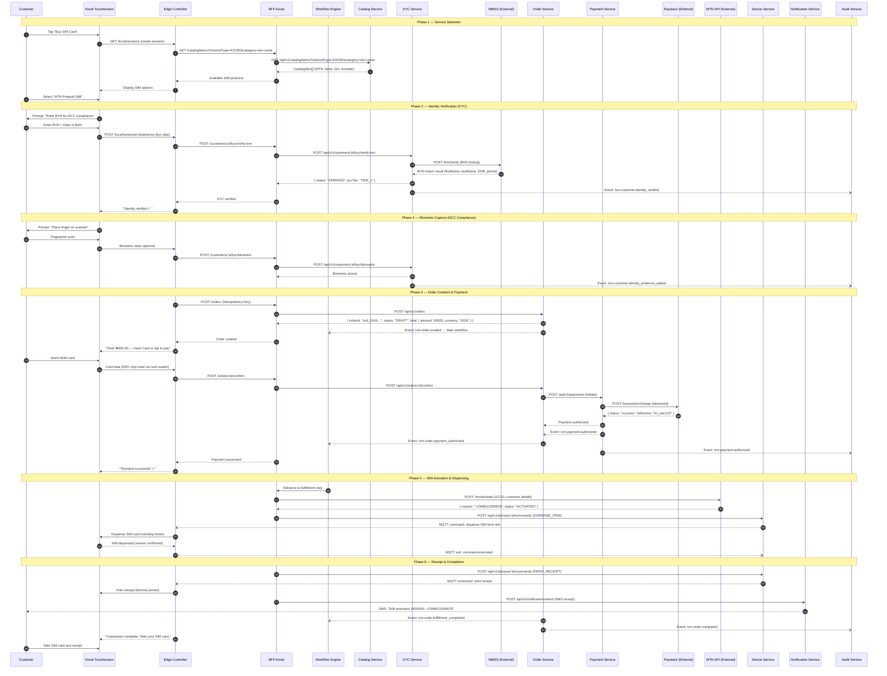
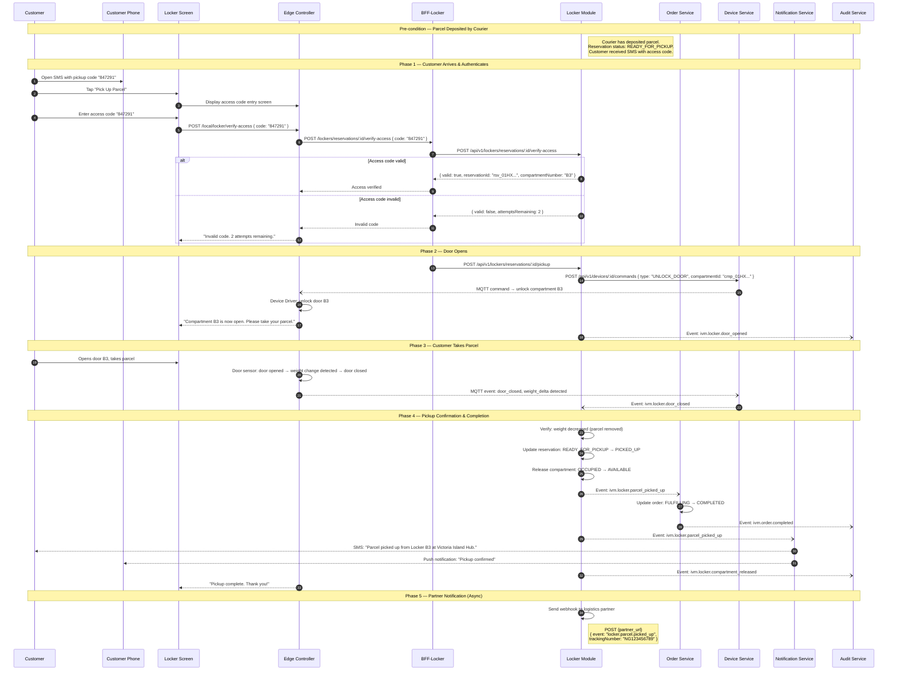
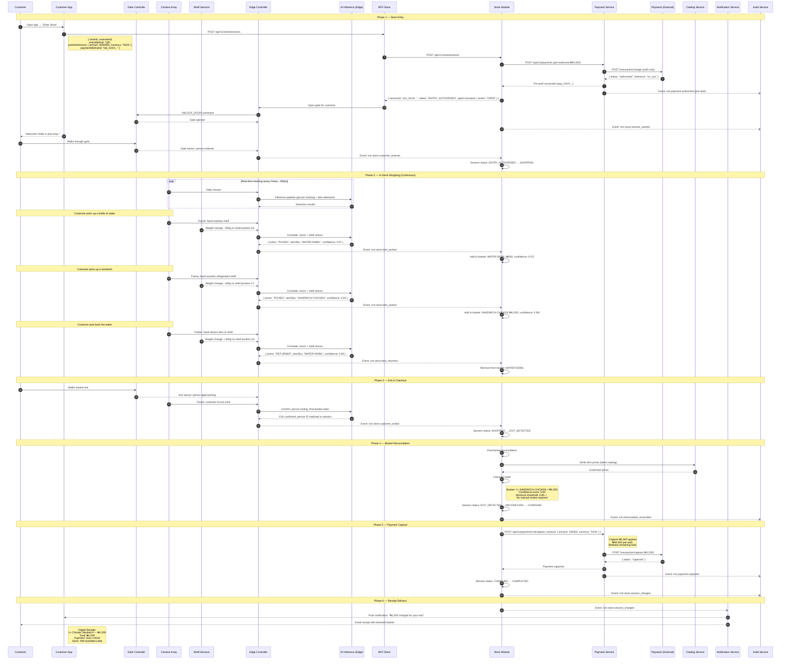
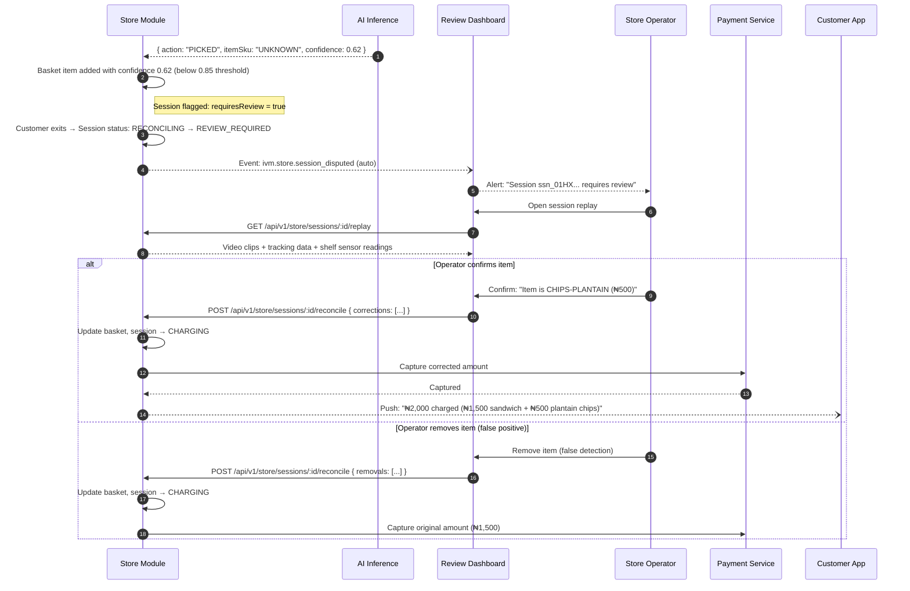
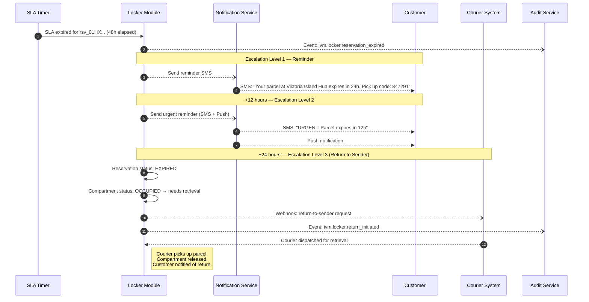
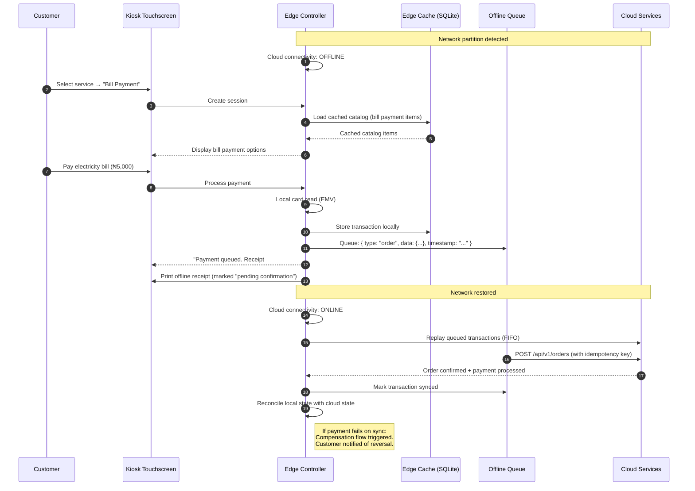

# D6 - Interaction Diagrams

## Overview

This document provides formal sequence diagrams for the three core commerce workflows of the IVM Platform:
1. **Kiosk Service Purchase** (SIM Registration)
2. **Smart Locker Parcel Pickup**
3. **Autonomous Store Checkout**

Each diagram shows the full end-to-end flow including edge, cloud, device, and external system interactions.

---

## 1. Kiosk Service Purchase — SIM Registration

This sequence shows a customer purchasing and registering a SIM card at a kiosk, which is the most complex service vending workflow as it involves KYC, external telco integration, hardware dispensing, and payment.

### Key Observations
- **Offline resilience:** Steps 1-3 (catalog, KYC) can use edge-cached data during cloud partition.
- **Idempotency:** Order creation uses `Idempotency-Key` header to prevent duplicate orders on device retry.
- **PCI scope:** Card data is read by the EMV reader on-device and tokenized before reaching the BFF — raw PAN never enters the platform.
- **NCC compliance:** Biometric + BVN verification required before SIM activation per Nigerian Communications Commission regulations.

---

## 2. Smart Locker Parcel Pickup

This sequence shows a customer picking up an e-commerce parcel from a smart locker after receiving a notification.

### Key Observations
- **Offline support:** Access code verification can occur locally at the edge if the code was pre-synced. Door unlock is entirely local.
- **Sensor fusion:** Weight sensor + door sensor combine to confirm parcel removal (prevents "opened but not taken" false positives).
- **SLA enforcement:** If pickup doesn't happen before `expiresAt`, the Locker Module triggers a `ivm.locker.reservation_expired` event, escalating to reminders and eventually return-to-sender.
- **Pay-on-pickup:** If `paymentRequired` flag is set, a payment step is inserted between access verification and door unlock.

---

## 3. Autonomous Store Checkout

This sequence shows the full flow from store entry to automatic checkout and payment capture.

### Key Observations
- **Edge-first processing:** All AI inference (person tracking, item detection) runs on-device at the edge (NVIDIA Jetson), achieving <100ms latency.
- **Sensor fusion:** Computer vision + shelf weight sensors corroborate each other for higher confidence scores.
- **Pre-authorization pattern:** ₦50,000 hold is placed at entry; actual basket total (₦1,500) is captured at exit; remaining hold is released.
- **Confidence threshold:** Items below 0.85 confidence trigger `REVIEW_REQUIRED` status, routing to human review with video evidence.
- **No checkout friction:** Customer walks out. Payment is automatic. Receipt arrives on phone.

---

## 4. Exception Flow — Low Confidence Item (Autonomous Store)

---

## 5. Exception Flow — Locker Pickup SLA Expiry

---

## 6. Offline Kiosk Transaction (Edge Resilience)

