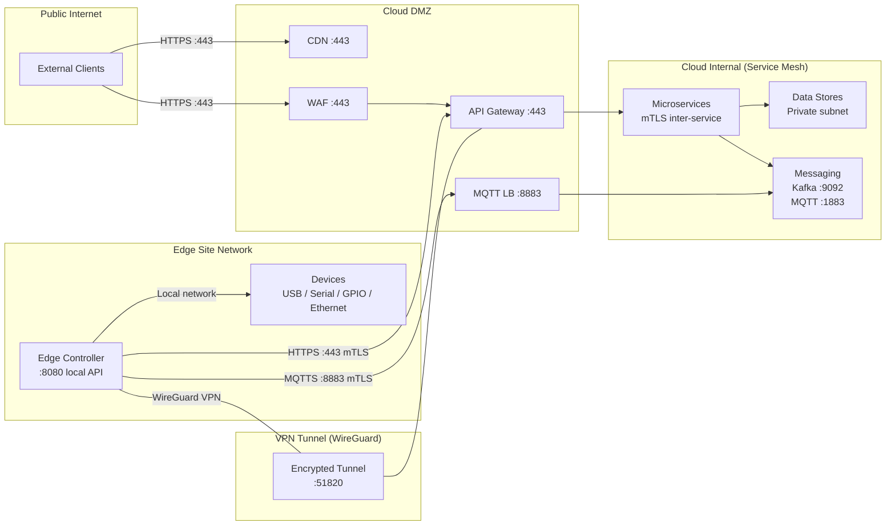
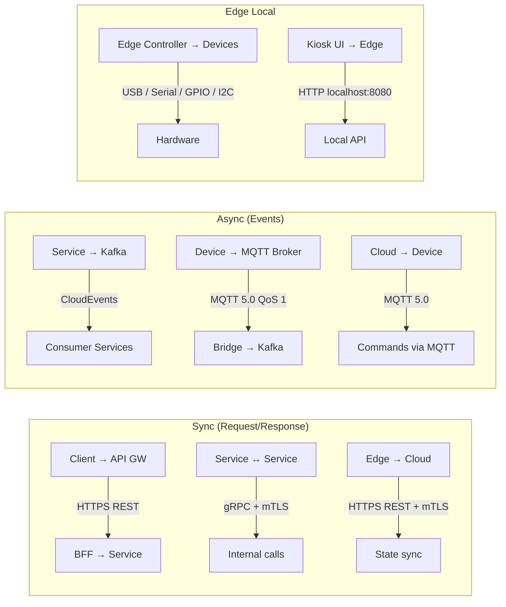

# D7 - Deployment Architecture

## Overview

This document defines the unified deployment architecture for the IVM Platform, showing how cloud services, edge nodes, physical devices, and messaging layers interconnect across a hybrid cloud + edge topology.

---

## 1. Unified Deployment Diagram

```mermaid
graph TB
    subgraph "INTERNET"
        CUSTOMER[Customer Mobile/Web]
        OPERATOR[Operator Portal]
        PARTNER[Partner APIs<br/>Telco / Insurance / Banking]
        PSP[Payment Gateways<br/>Paystack / Flutterwave]
        GOV[Government APIs<br/>NIBSS / NIMC / NCC]
    end

    subgraph "CLOUD REGION — Lagos / West Africa"
        subgraph "Edge Protection"
            CDN[CDN<br/>Static Assets]
            WAF[WAF<br/>DDoS Protection]
            LB[Load Balancer<br/>TLS Termination]
        end

        subgraph "API Gateway Layer"
            GW[API Gateway<br/>JWT / mTLS / Rate Limit<br/>Tenant Resolution]
        end

        subgraph "BFF Layer (ivm-bff namespace)"
            BFF_K[bff-kiosk<br/>×3 replicas]
            BFF_L[bff-locker<br/>×3 replicas]
            BFF_S[bff-store<br/>×2 replicas]
            BFF_C[bff-customer<br/>×3 replicas]
            BFF_O[bff-operator<br/>×2 replicas]
            BFF_T[bff-technician<br/>×2 replicas]
        end

        subgraph "Core Services (ivm-core namespace)"
            IAM[Identity & Access<br/>×3 replicas]
            CUST_SVC[Customer Service<br/>×3 replicas]
            KYC_SVC[KYC Service<br/>×3 replicas]
            TENANT_SVC[Tenant Service<br/>×2 replicas]
            CAT_SVC[Catalog Service<br/>×3 replicas]
            ORD_SVC[Order Service<br/>×3 replicas]
            PAY_SVC[Payment Service<br/>×3 replicas]
            WF_SVC[Workflow Engine<br/>×3 replicas]
            DEV_SVC[Device Service<br/>×3 replicas]
            SITE_SVC[Site Service<br/>×2 replicas]
            TEL_SVC[Telemetry Service<br/>×2 replicas]
            NOTIF_SVC[Notification Service<br/>×2 replicas]
            AUDIT_SVC[Audit Service<br/>×2 replicas]
            ANALYTICS_SVC[Analytics Service<br/>×2 replicas]
        end

        subgraph "Channel Modules (ivm-channels namespace)"
            SV_MOD[Service Vending<br/>Module ×2]
            LK_MOD[Locker Module<br/>×3 replicas]
            ST_MOD[Store Module<br/>×2 replicas]
        end

        subgraph "Data Layer (ivm-data namespace)"
            PG[(PostgreSQL 16<br/>Primary + Standby<br/>14 schemas)]
            TS[(TimescaleDB<br/>Telemetry)]
            REDIS[(Redis Cluster<br/>Cache + Sessions)]
            CH[(ClickHouse<br/>Data Warehouse)]
            S3[(Object Storage<br/>Media / Models / Backups)]
            VAULT[(HashiCorp Vault<br/>Secrets)]
        end

        subgraph "Messaging Layer (ivm-messaging namespace)"
            KAFKA[Apache Kafka<br/>3-node cluster<br/>9 domain topics + DLQs]
            MQTT_BROKER[EMQX MQTT Broker<br/>3-node cluster<br/>Device Communication]
            MQTT_BRIDGE[MQTT-Kafka Bridge<br/>Event Translation]
        end

        subgraph "Observability (ivm-monitoring namespace)"
            PROM[Prometheus<br/>Metrics]
            GRAF[Grafana<br/>Dashboards]
            LOKI[Loki<br/>Logs]
            TEMPO[Tempo<br/>Traces]
            ALERT[Alertmanager<br/>→ PagerDuty]
        end

        subgraph "Jobs (ivm-jobs namespace)"
            ETL[ETL Pipeline<br/>→ ClickHouse]
            REPORTS[Report Generator]
            SETTLEMENT[Settlement Batch]
            CLEANUP[Data Retention<br/>Cleanup Jobs]
        end
    end

    subgraph "DR REGION"
        DR_PG[(PG Read Replicas)]
        DR_KAFKA[Kafka Mirror]
        DR_K8S[Warm Standby K8s]
    end

    subgraph "EDGE SITE — Kiosk Station"
        subgraph "Edge Controller (RPi CM4 / Intel NUC)"
            E_GW[Edge Gateway<br/>Local REST API]
            E_DRV[Device Driver<br/>Manager]
            E_CACHE[State Cache<br/>SQLite + Memory]
            E_QUEUE[Offline Queue<br/>Store & Forward]
            E_TEL[Telemetry<br/>Collector]
            E_WF[Local Workflow<br/>Engine]
        end
        subgraph "Kiosk Devices"
            TOUCH[Touchscreen<br/>Display]
            SCAN[QR/Barcode<br/>Scanner]
            PRINTER[Thermal<br/>Printer]
            CARD[Card Reader<br/>EMV/NFC]
            BIO[Biometric<br/>Scanner]
            VEND[Vending<br/>Motor]
        end
    end

    subgraph "EDGE SITE — Locker Bank"
        subgraph "Edge Controller (RPi CM4)"
            EL_GW[Edge Gateway]
            EL_DRV[Device Driver<br/>Manager]
            EL_CACHE[State Cache]
            EL_QUEUE[Offline Queue]
        end
        subgraph "Locker Devices"
            L_SCREEN[Locker<br/>Display]
            L_LOCK[Electronic<br/>Locks ×N]
            L_SENSOR[Weight<br/>Sensors ×N]
            L_DOOR[Door<br/>Sensors ×N]
        end
    end

    subgraph "EDGE SITE — Autonomous Store"
        subgraph "Edge Controller (NVIDIA Jetson Orin)"
            ES_GW[Edge Gateway]
            ES_DRV[Device Driver<br/>Manager]
            ES_CACHE[State Cache]
            ES_AI[AI Inference<br/>Runtime<br/>TensorRT/ONNX]
            ES_VID[Video Pipeline<br/>Capture → Infer]
        end
        subgraph "Store Devices"
            S_CAM[Camera Array<br/>×8-16]
            S_SHELF[Shelf Sensors<br/>×50-100]
            S_GATE[Entry/Exit<br/>Gate Controllers]
            S_WEIGHT[Weight<br/>Sensors]
        end
    end

    %% Internet to Cloud
    CUSTOMER --> CDN
    CUSTOMER --> WAF
    OPERATOR --> WAF
    WAF --> LB
    LB --> GW

    %% Gateway to BFFs
    GW --> BFF_K
    GW --> BFF_L
    GW --> BFF_S
    GW --> BFF_C
    GW --> BFF_O
    GW --> BFF_T

    %% BFFs to Core Services
    BFF_K --> IAM
    BFF_K --> CAT_SVC
    BFF_K --> ORD_SVC
    BFF_K --> WF_SVC
    BFF_L --> LK_MOD
    BFF_S --> ST_MOD
    BFF_C --> ORD_SVC
    BFF_C --> CUST_SVC
    BFF_O --> TENANT_SVC
    BFF_O --> DEV_SVC
    BFF_O --> ANALYTICS_SVC

    %% Core to Data
    IAM --> PG
    CUST_SVC --> PG
    KYC_SVC --> PG
    TENANT_SVC --> PG
    CAT_SVC --> PG
    CAT_SVC --> REDIS
    ORD_SVC --> PG
    PAY_SVC --> PG
    WF_SVC --> PG
    DEV_SVC --> PG
    SITE_SVC --> PG
    TEL_SVC --> TS
    NOTIF_SVC --> PG
    AUDIT_SVC --> PG
    ANALYTICS_SVC --> CH

    %% Core to Messaging
    ORD_SVC --> KAFKA
    PAY_SVC --> KAFKA
    IAM --> KAFKA
    CUST_SVC --> KAFKA
    DEV_SVC --> KAFKA
    LK_MOD --> KAFKA
    ST_MOD --> KAFKA
    WF_SVC --> KAFKA
    NOTIF_SVC --> KAFKA
    AUDIT_SVC --> KAFKA

    %% MQTT
    MQTT_BRIDGE --> KAFKA
    MQTT_BROKER --> MQTT_BRIDGE
    DEV_SVC --> MQTT_BROKER

    %% External
    KYC_SVC --> GOV
    PAY_SVC --> PSP
    SV_MOD --> PARTNER

    %% DR
    PG -.-> DR_PG
    KAFKA -.-> DR_KAFKA

    %% Observability
    IAM -.-> PROM
    ORD_SVC -.-> PROM
    PROM --> GRAF
    LOKI --> GRAF
    TEMPO --> GRAF
    PROM --> ALERT

    %% Jobs
    KAFKA --> ETL
    ETL --> CH

    %% Edge Kiosk to Cloud
    E_GW -->|mTLS + VPN| GW
    E_TEL -->|MQTT over TLS| MQTT_BROKER
    E_QUEUE -->|Sync on reconnect| GW
    E_DRV --> TOUCH
    E_DRV --> SCAN
    E_DRV --> PRINTER
    E_DRV --> CARD
    E_DRV --> BIO
    E_DRV --> VEND

    %% Edge Locker to Cloud
    EL_GW -->|mTLS + VPN| GW
    EL_DRV --> L_SCREEN
    EL_DRV --> L_LOCK
    EL_DRV --> L_SENSOR
    EL_DRV --> L_DOOR

    %% Edge Store to Cloud
    ES_GW -->|mTLS + VPN| GW
    ES_AI --> S_CAM
    ES_DRV --> S_SHELF
    ES_DRV --> S_GATE
    ES_DRV --> S_WEIGHT
    ES_VID --> S_CAM
```



---

## 2. Network Architecture



### Port Map

| Service | Port | Protocol | Access |
|---|---|---|---|
| API Gateway | 443 | HTTPS | Public (TLS) |
| MQTT Broker | 8883 | MQTTS | Devices (mTLS) |
| Edge Local API | 8080 | HTTP | Site-local only |
| Kafka | 9092 | TCP | Internal only |
| PostgreSQL | 5432 | TCP | Internal only |
| Redis | 6379 | TCP | Internal only |
| Grafana | 3000 | HTTPS | Operator VPN |
| WireGuard VPN | 51820 | UDP | Edge controllers |

---

## 3. Kubernetes Namespace Layout

```
kubernetes-cluster/
├── ivm-gateway/          # API Gateway, Ingress Controllers
│   ├── api-gateway (×3)
│   └── ingress-nginx
│
├── ivm-bff/              # Backend-for-Frontend services
│   ├── bff-kiosk (×3)
│   ├── bff-locker (×3)
│   ├── bff-store (×2)
│   ├── bff-customer (×3)
│   ├── bff-operator (×2)
│   └── bff-technician (×2)
│
├── ivm-core/             # Core platform services
│   ├── identity-service (×3)
│   ├── customer-service (×3)
│   ├── kyc-service (×3)
│   ├── tenant-service (×2)
│   ├── catalog-service (×3)
│   ├── order-service (×3)
│   ├── payment-service (×3)
│   ├── workflow-service (×3)
│   ├── device-service (×3)
│   ├── site-service (×2)
│   ├── telemetry-service (×2)
│   ├── notification-service (×2)
│   ├── audit-service (×2)
│   └── analytics-service (×2)
│
├── ivm-channels/         # Channel module services
│   ├── service-vending-module (×2)
│   ├── locker-module (×3)
│   └── store-module (×2)
│
├── ivm-data/             # Stateful data services
│   ├── postgresql-primary
│   ├── postgresql-standby
│   ├── timescaledb
│   ├── redis-cluster (×3)
│   ├── clickhouse (×2)
│   └── vault
│
├── ivm-messaging/        # Event and device messaging
│   ├── kafka-broker (×3)
│   ├── kafka-zookeeper (×3)  # or KRaft
│   ├── schema-registry
│   ├── emqx-broker (×3)
│   └── mqtt-kafka-bridge (×2)
│
├── ivm-monitoring/       # Observability stack
│   ├── prometheus
│   ├── grafana
│   ├── loki
│   ├── tempo
│   └── alertmanager
│
└── ivm-jobs/             # Batch and scheduled jobs
    ├── etl-pipeline
    ├── report-generator
    ├── settlement-batch
    └── data-retention-cleanup
```

---

## 4. Edge Site Deployment Profiles

### 4.1 Kiosk Station

| Component | Specification |
|---|---|
| **Edge Controller** | Raspberry Pi CM4 (4GB RAM, 32GB eMMC) or Intel NUC |
| **OS** | Ubuntu Core 22.04 / Balena OS |
| **Container Runtime** | Docker CE |
| **Services** | Edge Gateway, Device Driver Manager, State Cache (SQLite), Offline Queue, Telemetry Collector, Local Workflow Engine |
| **Connectivity** | Primary: Ethernet; Failover: 4G LTE modem |
| **Cloud Link** | WireGuard VPN + MQTTS (port 8883) |
| **Devices** | Touchscreen, QR scanner, thermal printer, EMV card reader, biometric scanner, vending motor |
| **Power** | UPS-backed (15 min battery for graceful shutdown) |

### 4.2 Locker Bank

| Component | Specification |
|---|---|
| **Edge Controller** | Raspberry Pi CM4 (2GB RAM, 16GB eMMC) |
| **OS** | Ubuntu Core 22.04 |
| **Container Runtime** | Docker CE |
| **Services** | Edge Gateway, Device Driver Manager, State Cache, Offline Queue |
| **Connectivity** | Primary: Ethernet; Failover: 4G LTE modem |
| **Cloud Link** | WireGuard VPN + MQTTS |
| **Devices** | Locker display, electronic locks (×N), weight sensors (×N), door sensors (×N) |
| **Power** | Mains with UPS (battery locks fail-secure) |

### 4.3 Autonomous Store

| Component | Specification |
|---|---|
| **Edge Controller** | NVIDIA Jetson Orin (32GB RAM, 64GB NVMe) |
| **OS** | JetPack 6.0 (Ubuntu-based) |
| **Container Runtime** | Docker CE with NVIDIA Container Toolkit |
| **Services** | Edge Gateway, Device Driver Manager, State Cache, AI Inference Runtime (TensorRT), Video Pipeline, Telemetry Collector |
| **Connectivity** | Fiber/Ethernet (high bandwidth for video); Failover: 5G |
| **Cloud Link** | WireGuard VPN + MQTTS |
| **Devices** | Camera array (8-16 cameras), shelf weight sensors (50-100), entry/exit gate controllers, RFID readers |
| **GPU** | Jetson Orin: 2048 CUDA cores, 64 Tensor cores |
| **AI Models** | Person detection, item recognition, action classification |
| **Storage** | 1TB NVMe for video buffer (rolling 72h retention) |

---

## 5. Communication Protocols Summary



| Layer | Protocol | Security | Latency Target |
|---|---|---|---|
| Client → Cloud | HTTPS/REST | TLS 1.3 + JWT | < 200ms |
| Service → Service | gRPC | mTLS (service mesh) | < 50ms |
| Edge → Cloud (API) | HTTPS/REST | mTLS + VPN | < 500ms |
| Edge → Cloud (Telemetry) | MQTTS | mTLS (device cert) | Best-effort |
| Cloud → Edge (Commands) | MQTTS | mTLS | < 2s |
| Edge → Device | USB/Serial/GPIO | Physical isolation | < 10ms |
| AI Inference | Local GPU | On-device | < 100ms per frame |

---

## 6. Scaling Strategy

| Component | Scaling Model | Trigger | Min | Max |
|---|---|---|---|---|
| API Gateway | HPA (horizontal pod) | Request rate, P99 latency | 3 | 10 |
| BFF Services | HPA | Request rate | 2 | 8 |
| Core Services | HPA (stateless pods) | CPU > 70%, queue depth | 2 | 10 |
| Kafka | Partition scaling | Topic throughput | 3 brokers | 9 brokers |
| MQTT Broker | Cluster node scaling | Connected device count | 3 nodes | 9 nodes |
| PostgreSQL | Vertical + read replicas | Query load, connections | 1 primary + 1 standby | 1 primary + 3 replicas |
| Redis | Cluster shard scaling | Memory, connections | 3 nodes | 9 nodes |
| Edge Controllers | Fixed per site | N/A | 1 per site | 1 per site |
| AI Inference | GPU scaling (store) | Camera count, FPS | 1 Jetson/site | 2 Jetsons/site |

---

## 7. Availability Targets

| Component | Target | Strategy |
|---|---|---|
| Cloud Platform | 99.9% | Multi-AZ, auto-healing pods |
| API Gateway | 99.95% | Multi-instance, health checks |
| Payment Processing | 99.95% | Multi-gateway failover |
| MQTT Broker | 99.9% | Clustered, persistent sessions |
| Edge Controller | 99.5% online | Offline mode ensures 100% operational |
| Database (Primary) | 99.99% | Synchronous standby, auto-failover |
| Kafka | 99.95% | 3-way replication, ISR |

---

## 8. Disaster Recovery

| Scenario | RPO | RTO | Strategy |
|---|---|---|---|
| Single pod failure | 0 | < 30s | K8s auto-restart |
| Node failure | 0 | < 2 min | K8s reschedule to healthy node |
| AZ failure | 0 | < 5 min | Multi-AZ deployment |
| Region failure | < 5 min | < 30 min | DR region with async replication |
| Edge connectivity loss | 0 (local) | N/A | Offline queue, local processing |
| Database corruption | < 1 min | < 15 min | Point-in-time recovery from WAL |
